# **Overview** 
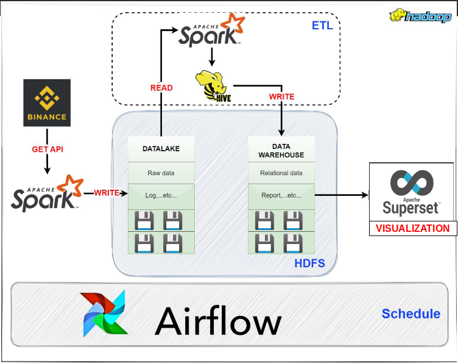

Preparation: Install Hadoop, Spark and Hive on Ubuntu operating system.

**Step 1**: Collect data from the binance.com website using the API, then save all that data to Data Lake as raw data. This process will be performed using Python and Apache Spark (PySpark).

**Step 2:** ETL (Extract, Transform, Load): Use Apache Spark to extract data from Data Lake, perform necessary processing such as filtering, transforming and cleaning data, then save data to Data Lake. Warehouse via Hive. Data will be saved as a relational database (RDB) or reports that can be queried and processed using SQL through Hive.

**Step 3:** Visualize data by creating reports and charts based on data saved on Data Warehouse. Apache Superset can be used to create compelling charts and reports to clearly see important information from the data.

**Step 4:** Use Apache Airflow to automate the entire process. Airflow will help determine the execution schedule of previous steps automatically, ensuring that data collection, ETL, and visualization are performed according to a predetermined schedule

# **Data Source** 
## Binance API [link](https://www.binance.com/en/support/faq/how-to-create-api-keys-on-binance-360002502072)

Binance test api:

`api_key = "aRkqlapnqhNXa1bYU4Q7QWkru6DHA5sdRrmKxnRTPXjbXbZhqOPCJ8p0oNCNNbhY"`

`api_secret = "uK3edZV3Wy2blZHEC67UlsQVgm48JRz1WlWi5ZNrJDg4Aajt3B0QwDMQjOS6cHnH"`
# **Data Lake** 
## Symbol_Infor table 
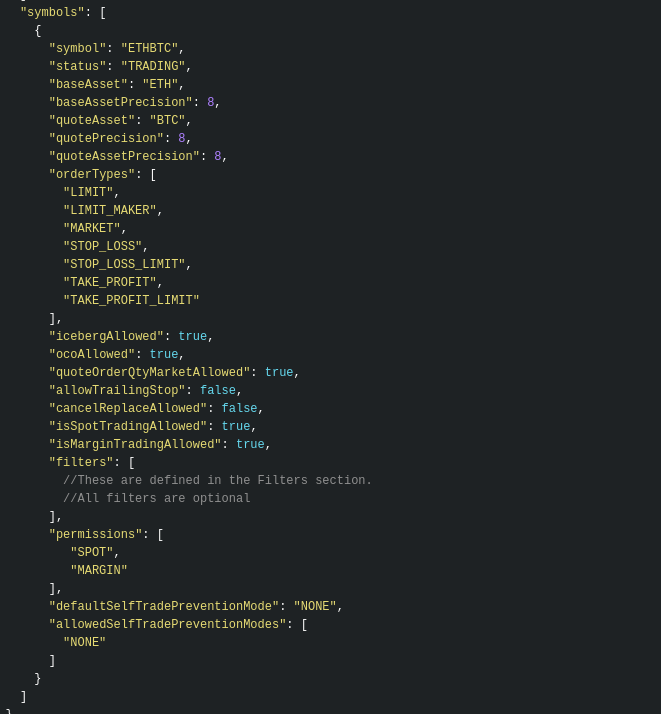
## Ticker_24 table 
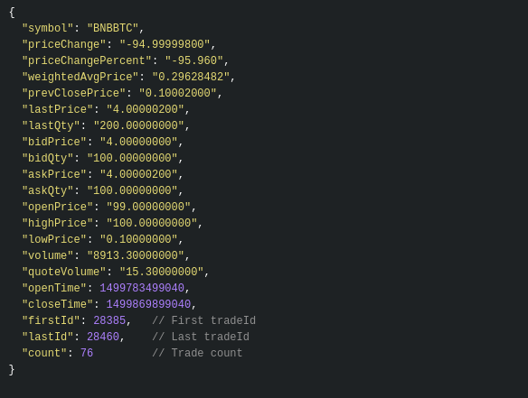
## Klines table 
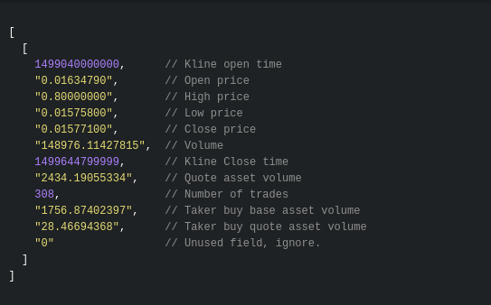
## Trades table 
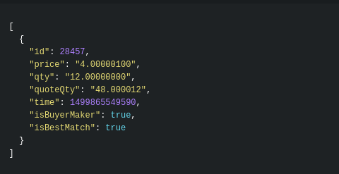

## Hadoop hdfs
Hadoop hdfs is the location used to store raw data for data lake with partitioned format.

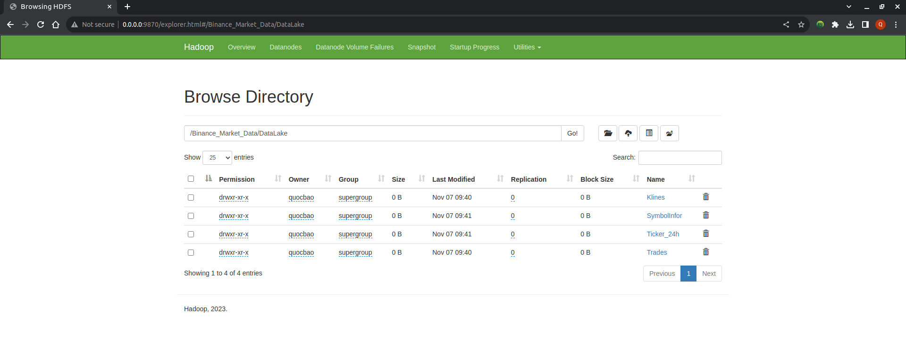
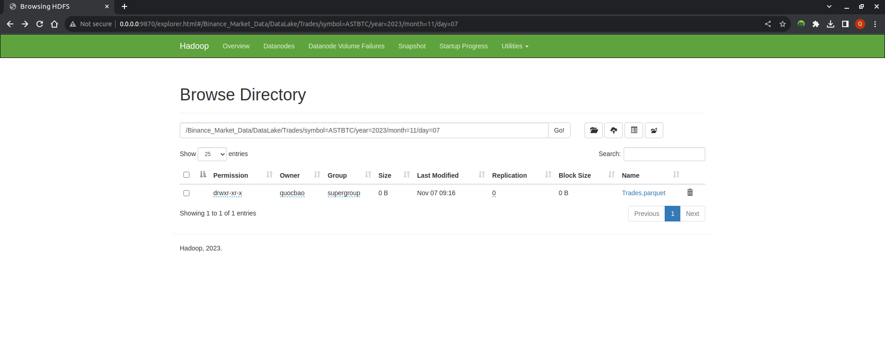
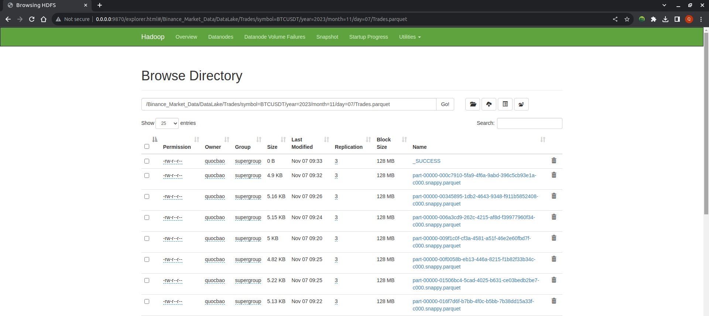

# **Data Warehouse** 
[**Data Warehouse Model**](https://dbdiagram.io/d/64b2209402bd1c4a5e1d07ad)

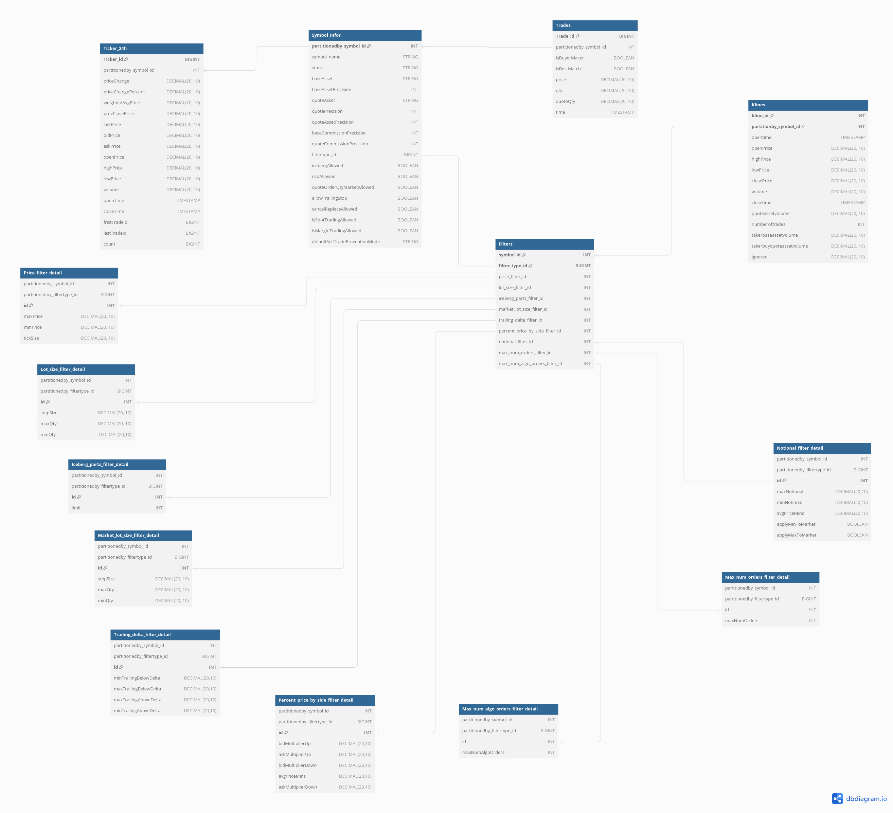

Data Warehouse in Hadoop hdfs

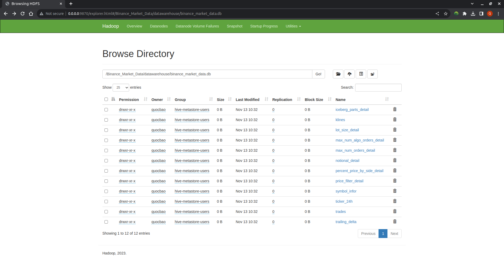
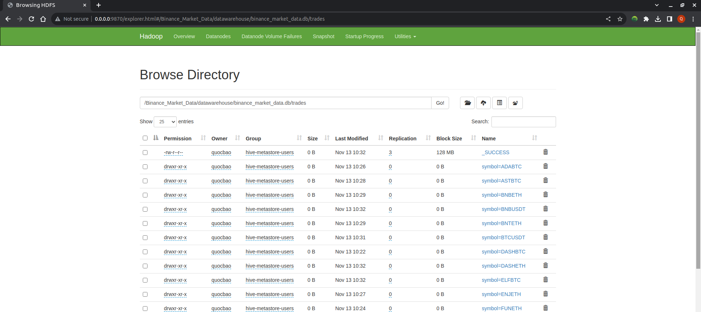
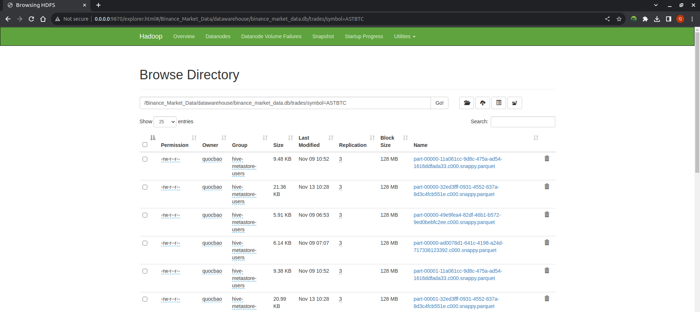

# **Airflow Pipeline** 
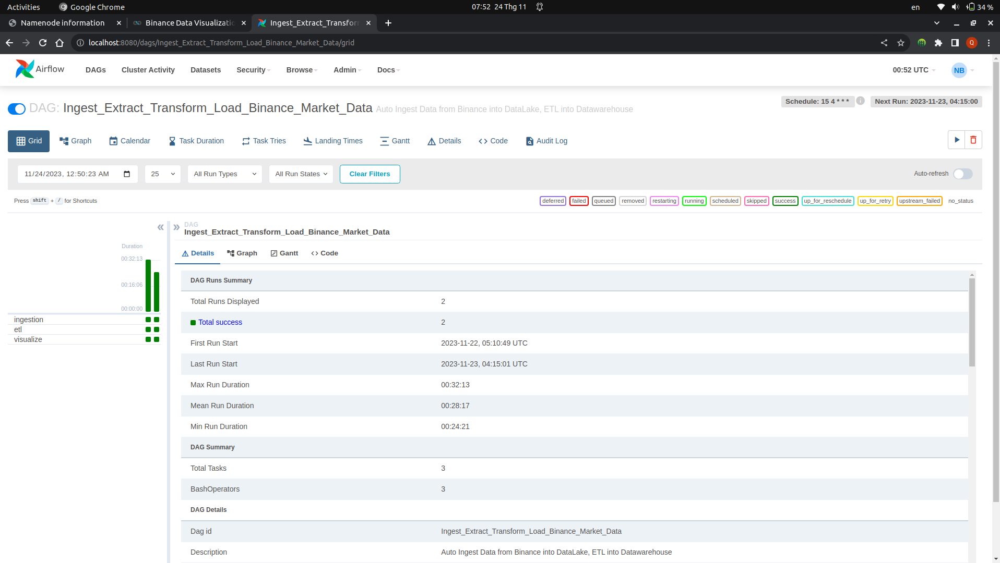
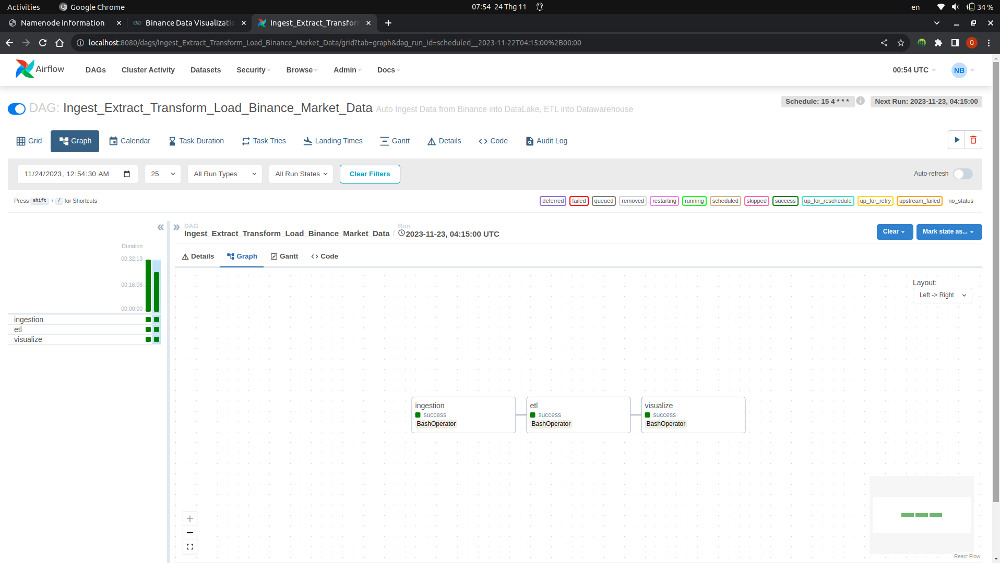

# **Superset Visualization** 
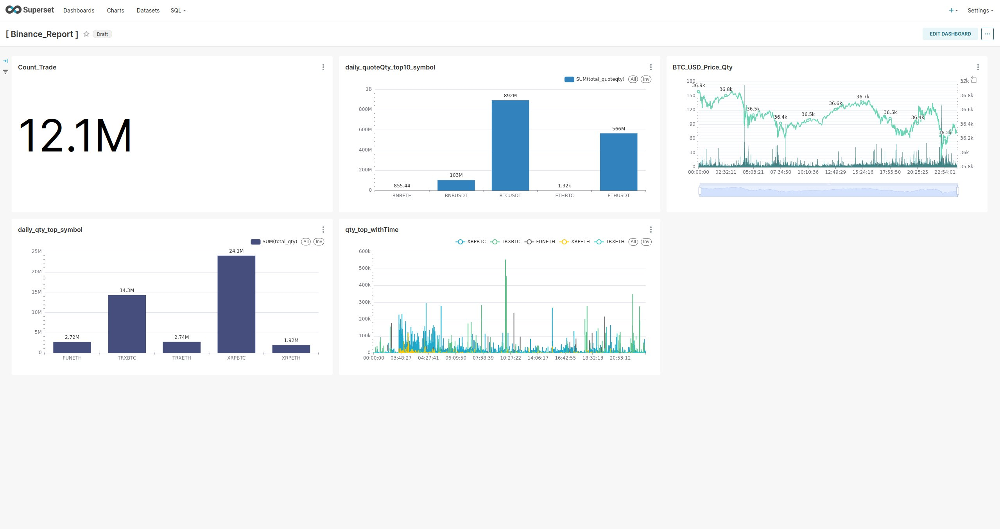

